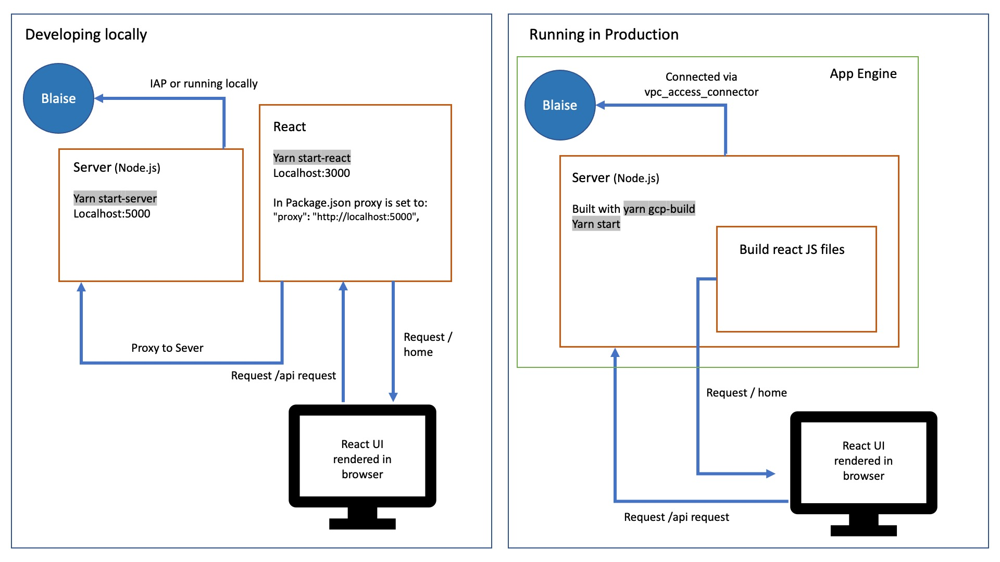

# Blaise User Management

[](https://codecov.io/gh/ONSdigital/blaise-user-management)
[](https://github.com/ONSdigital/blaise-user-management/workflows/Test%20coverage%20report/badge.svg)

[](https://github.com/ONSdigital/blaise-user-management/pulls)
[](https://github.com/ONSdigital/blaise-user-management/commits)
[](https://github.com/ONSdigital/blaise-user-management/graphs/contributors)

Dashboard for managing Blaise users.

This project is a React application which when built is rendered by a Node.js express server.



### Local Setup

Prerequisites
- [Node.js](https://nodejs.org/)
- [Yarn](https://yarnpkg.com/)
- [Cloud SDK](https://cloud.google.com/sdk/)

Clone the repository:

```shell script
git clone https://github.com/ONSdigital/blaise-user-management.git
```

Create an .env file in the root of the project and add the following variables:

| Variable            | Description                                                                                                                                                                                                                                                                            | Var Example          |
|---------------------|----------------------------------------------------------------------------------------------------------------------------------------------------------------------------------------------------------------------------------------------------------------------------------------|----------------------|
| PORT                | **Optional variable**, specify the Port for express server to run on. If not passed in this is set as 5000 by default. <br><br>It's best not to set this as the react project will try and use the variable as well and conflict. By default, React project locally runs on port 3000. | 5009                 |
| BLAISE_API_URL      | Url that Blaise REST API is running on to send calls to.                                                                                                                                                                                                                     | localhost:8011       |
| SERVER_PARK         | Blaise Server Park Name, required for creating users in the correct server park                                                                                                                                                                                                        | gusty                |
| PROJECT_ID      | Variable to set up the project id to be used, mostly it should be set up to your sandbox id, like example string appended with your sandbox suffix                                                                                                                                                                                                                     | ons-blaise-v2-dev-<sandbox-suffix>       |
| SESSION_TIMEOUT      | **Optional variable**, Variable to set up the session timeout, If not set up, it defaults to 12h                                                                                                                                                                                                                     |  12h       |


Example .env file:

```.env
BLAISE_API_URL='localhost:8011'
SERVER_PARK=gusty
PROJECT_ID='ons-blaise-v2-dev-<sandbox-suffix>'
SESSION_TIMEOUT=12h
```

Install the project dependencies:

```shell script
yarn
```

Authenticate with GCP:
```shell
gcloud auth login
```

Set your GCP project:
```shell
gcloud config set project ons-blaise-v2-dev-<sandbox-suffix>
```

Open a tunnel to our Blaise RESTful API in your GCP project:
```shell
gcloud compute start-iap-tunnel restapi-1 80 --local-host-port=localhost:8011 --zone europe-west2-a
```

Ensure the proxy is configured to the correct port in the 'package.json'

```.json
"proxy": "http://localhost:5000",
```

In a new terminal, run Node.js server and React.js client via the following package.json script

```shell script
yarn dev
```

The UI should now be accessible via:

http://localhost:3000/

Tests can be run via the following package.json script:

```shell script
yarn test
```

Test snapshots can be updated via:

```shell script
yarn test -u
```


##### Run commands

The following run commands are available. These are all setup in the `package.json` under `scripts`.

| Command             | Description                                                                                                                                                                              |
|---------------------|------------------------------------------------------------------------------------------------------------------------------------------------------------------------------------------|
| `yarn start-server` | Start the express server, Note: For the website to be rendered the React Project will need to be built.                                                                                  |
| `yarn start-react`  | Starts React project in local development setup with quick reloading on making changes. Note: For questionnaires to be shown the server needs to be running.                                |
| `yarn build-react`  | Compiles build project ready to be served by express. The build in outputted to the the `build` directory which express points to with the var `buildFolder` in `server/server.js`.      |
| `yarn test`         | Runs all tests for server and React Components and outputs coverage statistics.                                                                                                          |
| `gcp-build`         | [App Engine custom build step](https://cloud.google.com/appengine/docs/standard/nodejs/running-custom-build-step) which builds the react application and complies the TypeScript server. |

> ⚠ :warning: **If you are running locally**: Ignore the following error when you start the server with either yarn -start-server command or yarn dev!
"Failed to start profiler: Error: Service must be specified in the configuration" It is related to google Cloud Profiler API that is enabled to measure code performance in production environment.
