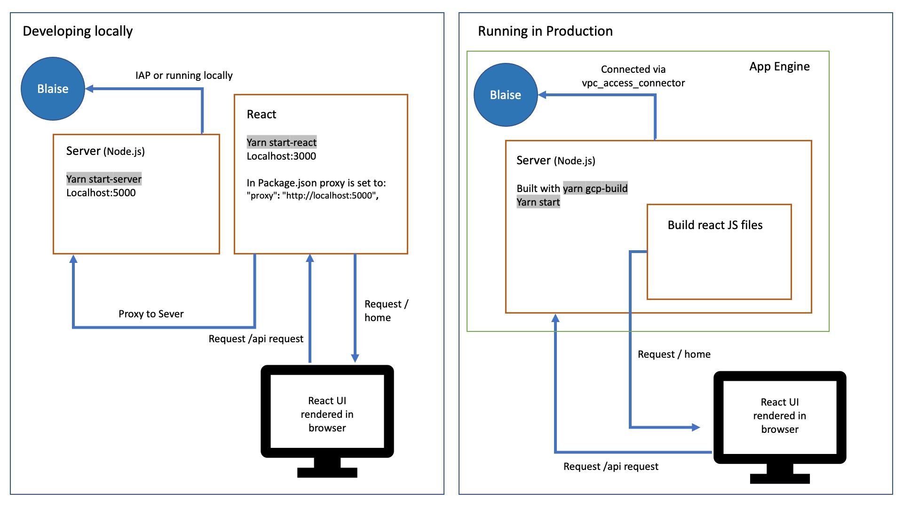

# Blaise Access Management (BAM) 🔑

Blaise Access Management (BAM) provides a web UI for managing user access to the Blaise platform.

The app is a React frontend served by an Express backend.



## Local Development

### Prerequisites

- [Node.js](https://nodejs.org/) 24+ (see `engines` in [package.json](package.json))
- [Yarn](https://yarnpkg.com/) 4+
- [Google Cloud SDK (`gcloud` CLI)](https://cloud.google.com/sdk/)

### Clone and install packages

```shell
git clone https://github.com/ONSdigital/blaise-access-management.git
cd blaise-access-management
yarn install
```

### Authenticate with Google Cloud (keyless)

```shell
gcloud auth login
gcloud config set project ons-blaise-v2-dev
```

### Start an IAP tunnel to Blaise REST API

Run this in a separate terminal and keep it running:

```shell
gcloud compute start-iap-tunnel restapi-1 80 --local-host-port=localhost:8080 --zone europe-west2-a
```

Expected output includes `Listening on port [8080]`.

### Configure environment variables

Create a `.env` file in the repository root.

Example `.env` file:

```ini
BLAISE_API_URL=localhost:8080
SERVER_PARK=gusty
PROJECT_ID=ons-blaise-v2-dev
URL_DOMAIN=localhost
SESSION_SECRET=blah
```

### Run the app

Standard mode:

```shell
yarn dev
```

For WSL/mounted paths (polling mode):

```shell
yarn dev-wsl
```

UI is available at http://localhost:3000/.

If local processes become stale, stop known ports and watchers:

```shell
yarn kill
```

## Common Scripts

- `yarn dev`: Run frontend + backend in watch mode
- `yarn dev-wsl`: Run with polling watcher support for WSL/mounted paths
- `yarn build`: Build client and server
- `yarn typecheck`: Run TypeScript checks for frontend and server projects
- `yarn lint`: Run typecheck, ESLint, Prettier checks, and knip
- `yarn lint-fix`: Auto-fix lint/prettier issues and run knip fix
- `yarn test`: Run Vitest suite with coverage
- `yarn test-watch`: Run Vitest in watch mode
- `yarn spellcheck`: Run cspell over code/config/docs files
